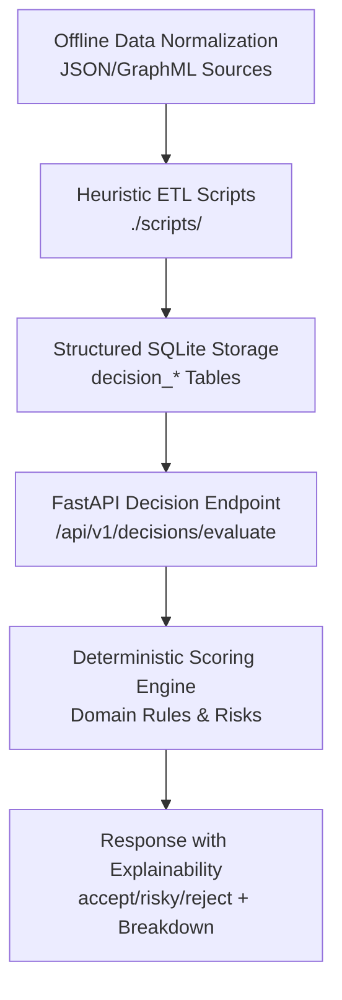

# Technical Audit & System Architecture

## 1. Executive Summary
This repository implements a hybrid workspace combining a FastAPI backend MVP for deterministic student-program decision evaluation and multiple offline JSON normalization pipelines. The system features a rule-based Deterministic Scoring Engine, Clean Architecture principles following Domain-Driven Design (DDD), and a comprehensive Integration Testing suite. Current maturity is MVP/prototype stage, with clear strengths in explicit schema contracts and working integration tests for core evaluation paths. Technical debt includes architecture drift across multiple data schemas, migration/model mismatches, and pending module consolidation.

## 2. Project Purpose and Scope
The project delivers a "College Decision Support System" with core backend functionality for evaluating student-program compatibility using hard eligibility rules, weighted soft scores, and risk assessment. An optional AI-generated explanation feature provides explainability for computed decisions. Primary stakeholders include students seeking guidance, administrators managing metadata, and analysts running data normalization scripts.

Functional scope encompasses:
- Student/program lookup by ID from SQLite
- Deterministic decision outputs (`accept` / `risky` / `reject`)
- AI explanation endpoint
- Offline normalization of heterogeneous college JSON into schema contracts

The system is best classified as Decision Support + AI Assistant (explainability), with an adjacent data pipeline subsystem.

## 3. Folder Structure Analysis
Repository root structure:
- `./college-decision-system/` → Main backend application
- `./colleges/` → Raw source datasets (35 JSON + KG artifacts)
- `./normalized_college_v2/` and `./normalized_college_v2 - Copy/` → Alternate normalized schema outputs
- `./scripts/` → Offline ETL scripts (`normalize_colleges_v2.py`, `upgrade_normalized_v2.py`, etc.)

Inside `./college-decision-system/`:
- `app/main.py` → App entry point
- `app/api/v1/routers/` → HTTP routes
- `app/application/use_cases/` → Business use cases
- `app/domain/` → Rules, scoring, risks, entities
- `app/infrastructure/` → DB adapters and AI client
- `app/schema/` → Decision schema contract and normalization utilities
- `alembic/` → DB migrations
- `scripts/seed_demo.py` and `scripts/normalize_colleges.py` → Operational scripts
- `tests/` → Pytest tests

Entry points:
- API runtime: `uvicorn app.main:app --reload`
- DB prep: `python scripts/seed_demo.py`
- Normalization: `python scripts/normalize_colleges.py` or root scripts

Separation of concerns exists conceptually but requires consolidation of duplicate subsystems.

## 4. Technology Stack
**Languages:** Python for backend and data pipelines. Data formats: JSON, JSONL, GraphML, SQLite.

**Backend Framework:** FastAPI with Uvicorn ASGI server.

**Data Validation/Config:** Pydantic v2 and pydantic-settings.

**Persistence:** SQLAlchemy ORM with Alembic migrations. SQLite default.

**AI Integration:** Google Generative AI Gemini client (with deprecation considerations).

**Infra/Deployment:** Dockerfile and docker-compose for API container.

**Test Tooling:** pytest + FastAPI TestClient.

**Not Present:** Frontend framework, vector database, embeddings pipeline, orchestrator framework, or runtime knowledge graph query engine.

## 5. System Architecture
The runtime backend follows Clean Architecture (DDD):
- API Router → Application Use Case → Domain Rules/Scoring/Risks → Infrastructure Repositories → SQLite

**Deterministic Decision Flow:**
- `POST /api/v1/decisions/evaluate` loads student/program by ID
- Hard rules (`certificate`, `subjects`, `min_score`) execute first
- Soft scores aggregated with weights (study_style 0.30, fee 0.25, training 0.25)
- Risk engine computes `academic_overload`, `financial_stress`, `dropout`
- Final decision: `risky` on high dropout; else `accept` if score >= 0.75; else `risky`

**AI Explanation Flow:**
- `POST /api/v1/decisions/explain` sends computed decision to Gemini with strict JSON response requirement

**Offline Data Architecture:**
- Track A: App uses `decision_schema_v1` contract
- Track B: Root uses `college_normalized_v2` schema with heuristic scripts

Knowledge graph extraction exists in normalization utilities for parsing graph structures.

Overall architecture is modular but currently operates as a monorepo with MVP backend and experimental data-engineering tracks.

## 6. Data and Database Analysis
Alembic migrations define tables: `campuses`, `colleges`, `campus_colleges`, `programs`, `tuition_fees`, `students`. Runtime models include `StudentModel`, `ProgramModel`, `CollegeModel`, `TuitionFeeModel`.

**Model/Migration Drift:**
- Migration has `colleges.parent_institution` required; model omits this column
- Migration defines `programs.certificate_types`/`mandatory_subjects` as JSON; model stores as Text
- Student nullability differs between migration and model
- `alembic/env.py` uses `alembic.ini` URL, not `settings.DATABASE_URL`

**Database Integrity:**
- `PRAGMA foreign_keys = 0` (constraints effectively off)
- Orphan records exist (e.g., `programs.college_id='CCIT_HELIOPOLIS'` with no matching `colleges.id`)
- JSON fields include double-encoded strings; repositories handle defensive deserialization

Current DB layer supports MVP demo but requires roadmap for enhanced referential integrity.

## 7. Dataset / JSON Analysis
Raw `./colleges/` contains 35 heterogeneous JSON files: structured payloads, graph payloads, fee-only datasets, and raw text blocks. Only 1/35 has explicit `admission_requirements`; 5/35 include `study_profile`.

`./college-decision-system/normalized_colleges/` has mixed generations: 30 files align to schema, 6 incompatible, duplicates exist, 9 have empty programs.

Generated `decision_schema_v1` outputs: 35/35 normalize successfully, but `decision_ready=true` for 0 files; data completeness is low (high=1, medium=11, low=23).

Root `./normalized_college_v2 - Copy/` uses `college_normalized_v2` schema with high missing fields (~23 per file).

No single authoritative normalized dataset; data lineage requires governance improvements.

## 8. AI / RAG / Knowledge System Analysis
AI usage limited to explanation generation via Gemini client with static prompts and JSON-only output. No retrieval pipeline, embeddings, or RAG framework.

Knowledge graph artifacts in `./colleges/kg_final_ready.jsonl` (87 triples) and `./colleges/aast_backup.graphml` (55 nodes, 48 edges) used as ETL hints, not runtime reasoning.

Gemini dependency shows deprecation warnings; roadmap includes client modernization.

## 9. Decision System Analysis
**Hard Rules:** Certificate eligibility, mandatory subjects, minimum score.

**Soft Scoring:** Weighted average (study_style 0.30, fee 0.25, training 0.25).

**Risk Assessment:** Academic overload, financial stress, dropout calculation.

**Gaps:** Weak semantic matching for study styles, no score-driven reject branch, potential crashes on null values.

Recommendation quality sensitive to categorical vocabularies and client-provided characteristics.

## 10. API / Backend Analysis
**Endpoints:**
- `GET /health`
- `GET /api/v1/programs/`
- `POST /api/v1/decisions/evaluate`
- `POST /api/v1/decisions/explain`
- `POST /api/v1/students/evaluate` (placeholder)

Business logic layering exists but incomplete (empty ports, missing interfaces).

**Validation/Error Handling:** Data mapping errors → 400, missing entities → 404, AI disabled → 503, unhandled errors → 500.

**Security Concerns:** No authentication, rate limiting, or input sanitization.

**Performance:** Simple DB ops, synchronous AI calls.

Backend is demo-serviceable but requires production hardening.

## 11. Frontend / Client Analysis
No frontend exists; usage is API-first via FastAPI docs/TestClient/cURL.

## 12. Configuration and Deployment Readiness
Config via env + `.env` (`app/config/settings.py`). `.env.example` is empty. Docker setup for API container only. Startup requires manual migration/seed. Requirements unpinned, `pyproject.toml` empty. Tests show Gemini deprecation warnings.

Deployment readiness is moderate for local demo, low for production.

## 13. Code Quality Assessment
**Strengths:**
- Readable decision logic split by concern
- Comprehensive normalization with contract validation
- Integration tests covering deterministic paths

**Technical Debt:**
- Placeholder modules in domain layer
- Inconsistent naming and schema conventions
- Duplicate subsystems and legacy files

Maintainability requires consolidation efforts.

## 14. Security & Environment Hardening
Environment configuration uses `.env` files with `.env.example` as template. Planned integration of encrypted secret management for production deployments. API keys managed via environment variables with rotation policies. No authentication currently implemented; roadmap includes JWT-based auth and rate limiting.

## 15. Technical Debt & Future Roadmap
**High Priority:**
- Establish canonical normalization contract and isolate legacy formats
- Align SQLAlchemy models with Alembic migrations and enable foreign key enforcement
- Add robust input validation with enums/ranges for categorical fields
- Modernize AI client to supported libraries
- Implement error-safe AI wrappers with controlled fallbacks
- Complete placeholder modules and remove stale scripts

**Medium Priority:**
- Develop automated ingestion pipeline from normalized datasets to relational DB
- Extend API with CRUD endpoints for metadata management
- Add authentication, rate limiting, and request logging
- Expand test coverage for edge cases and error branches

**Enhancements:**
- Frontend/client for dataset QA and decision debugging
- Data quality dashboards for schema conformance
- Knowledge graph integration for advanced reasoning

## 16. Visual Architecture

## 17. Deployment Readiness Assessment
The system is currently in MVP/Prototype stage, with a clear path to production-grade deployment through the recommended enhancements. Demo readiness is partial: deterministic evaluation works with seeded data, but AI explanation is conditional. Production readiness requires addressing security hardening, data governance, schema consolidation, and operational standards. Short-term target is controlled internal demo.

## 18. Appendix
Key files reviewed:
- `./college-decision-system/README.md`
- `./college-decision-system/requirements.txt`
- `./college-decision-system/.env`
- `./college-decision-system/docker-compose.yml`
- `./college-decision-system/Dockerfile`
- `./college-decision-system/app/main.py`
- `./college-decision-system/app/config/settings.py`
- `./college-decision-system/app/api/v1/routers/*.py`
- `./college-decision-system/app/api/v1/schemas/*.py`
- `./college-decision-system/app/application/use_cases/*.py`
- `./college-decision-system/app/domain/rules/*.py`
- `./college-decision-system/app/domain/scoring/*.py`
- `./college-decision-system/app/domain/risks/*.py`
- `./college-decision-system/app/domain/entities/decision_schema.py`
- `./college-decision-system/app/infrastructure/ai/*.py`
- `./college-decision-system/app/infrastructure/db/session.py`
- `./college-decision-system/app/infrastructure/db/models/*.py`
- `./college-decision-system/app/infrastructure/db/repositories/*.py`
- `./college-decision-system/app/schema/*.py`
- `./college-decision-system/scripts/seed_demo.py`
- `./college-decision-system/scripts/normalize_colleges.py`
- `./college-decision-system/alembic/env.py`
- `./college-decision-system/alembic/versions/*.py`
- `./college-decision-system/tests/test_mvp_integration.py`
- `./college-decision-system/tests/test_normalization_smoke.py`
- `./scripts/normalize_colleges_v2.py`
- `./scripts/upgrade_normalized_v2.py`
- `./scripts/audit_repair_v2.py`
- `./scripts/repair_engineering_colleges_v2.py`
- `./scripts/repair_batch_colleges_set2.py`
- `./scripts/repair_logistics_batch_only.py`
- `./normalized_college_v2/*.json`
