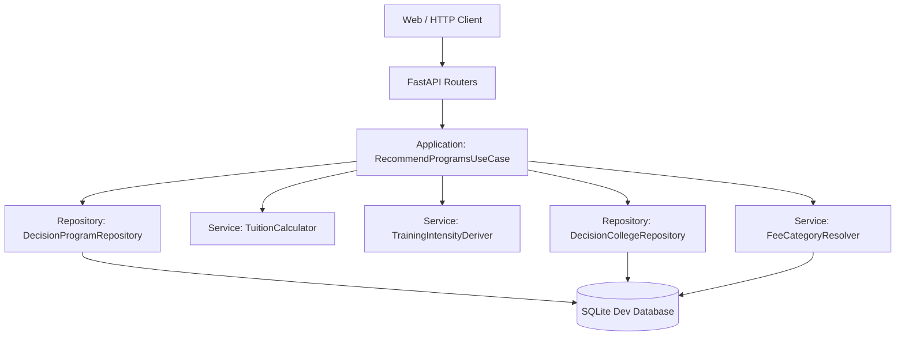
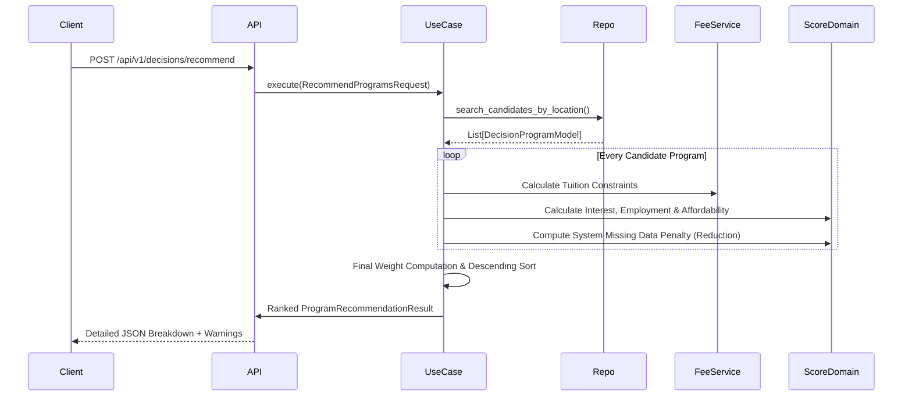

# AI College Decision System - Production Documentation

## 1. Project Overview
**What the project does:**  
The AI College Decision System is a production-ready college and program recommendation API. It matches prospective students with academic programs by calculating deterministic scores based on user profiles, affordability, and program traits, backed by a normalized data schema.

**Main problem it solves:**  
Students comparing colleges face fragmented data regarding admission requirements, fee rules, and employment outcomes. This system aggregates this metadata, standardizes fee structures, and exposes explainable recommendation reasoning that highlights missing-data risks to avoid misleading students.

**Target users:**  
- **Students:** Seeking accurate, data-backed insights on which program best fits their interests, budget, and academic background.  
- **Administrators/Advisors:** Who can use the system's "explainability" outputs to guide students during counseling or handle edge cases.

**High-level workflow:**  
1. A client submits a `POST /api/v1/decisions/recommend` request with student details (certificate type, high school percentage, budget, interests, track type).  
2. The core API parses the request, fetches candidate programs via SQLite DB repositories.  
3. The Use Case delegates to domain services to resolve tuition categories, calculate estimated semester fees, and derive curriculum intensity.  
4. Programs are scored deterministically based on affordability, interest alignment, employment outlook, and career flexibility.  
5. Incomplete data is factored in via a "missing data penalty."  
6. A ranked response is returned, comprising the top programs along with deep explanations, granular fee structures, and transparent warnings about any incomplete college data.

---

## 2. Project Architecture
**Architecture Style: Clean Architecture / Domain-Driven Design (DDD)**  
The backend strictly adheres to Clean Architecture practices, isolating core business logic from framework and infrastructure details. This design ensures the Deterministic Scoring Engine remains decoupled from external dependencies, enabling robust asynchronous API orchestration and maintainable domain modeling.

**Folder Structure Explanation:**  
- `college-decision-system/app/api/` (Presentation/Adapters): Contains the FastAPI routers and Pydantic schemas validating input/output.  
- `college-decision-system/app/application/` (Application Layer): Orchestrates business use cases (`recommend_programs.py`) and utilizes reusable domain services (`fee_category_resolver.py`, `tuition_calculator.py`).  
- `college-decision-system/app/domain/` (Domain Layer): Pure business logic, value objects, rules, and scoring logic that are completely agnostic to the DB or HTTP layer.  
- `college-decision-system/app/infrastructure/` (Infrastructure Layer): Contains Database configurations, SQLAlchemy ORM models, Alembic migrations, Repositories orchestrating queries, and third-party integrations (e.g., AI/Gemini fallback).  
- `colleges/` & `normalized_college_v2/`: Raw datasets and JSON outputs used in heuristic data normalization processes.  
- `scripts/`: Integrated ingestion, normalization, and integrity audit scripts.

**Responsibility of Major Folders:**  
- **`app/api/v1/routers/`**: Handles incoming HTTP requests, invokes use cases, and shapes response JSON.  
- **`app/application/use_cases/`**: Contains the `RecommendProgramsUseCase` which acts as the system's brain at runtime, calling repositories and domain services sequentially.  
- **`app/infrastructure/db/models/`**: Maps Python domain concepts into relational SQLite schema objects using SQLAlchemy.

---

## 3. Technology Stack
**Programming Language:** Python 3.10+  
**Framework:** FastAPI (for high-performance async REST API generation)

**Libraries:**  
- `pydantic>=2.0.0` & `pydantic-settings`: Data validation, serialization, and environment configuration.  
- `sqlalchemy`: Object-Relational Mapping (ORM) and complex DB queries.  
- `alembic`: Database migration orchestration.  
- `pytest` & `httpx`: Unit and integration testing, mimicking client requests.  
- `google-generativeai`: Used historically for natural language explanations, though the runtime strictly favors deterministic scoring paths.

**Databases:**  
- **SQLite:** Used natively (`dev.db`) for lightweight development and persistence of the structured `decision_*` schema data.

**ML/AI Tools:**  
- The heuristic data normalization processes map semantic text/JSON graphs into relational formats.  
- Google Gemini API (`gemini_client.py`) is supported but architecturally sidelined in favor of clear, rule-based text breakdown explanations.

---

## 4. Installation & Setup

### Prerequisites
- Python 3.10 or higher
- pip package manager

### Installation Steps
1. **Clone the repository:**
   ```bash
   git clone <repository-url>
   cd college-decision-system
   ```

2. **Create a virtual environment:**
   ```bash
   python -m venv venv
   source venv/bin/activate  # On Windows: venv\Scripts\activate
   ```

3. **Install dependencies:**
   ```bash
   pip install -r requirements.txt
   ```

4. **Configure environment variables:**
   Create a `.env` file in the root directory with the following placeholders:
   ```env
   DATABASE_URL=sqlite:///./dev.db
   GEMINI_API_KEY=your_gemini_api_key_here
   ```

5. **Initialize the database:**
   ```bash
   python -m alembic upgrade head
   ```

6. **Run the application:**
   ```bash
   uvicorn app.main:app --reload
   ```

The API will be available at `http://localhost:8000` with interactive documentation at `http://localhost:8000/docs`.

---

## 5. File-by-File Explanation
**Core System Files:**

1. **`app/main.py`**  
   - *Purpose:* Entry point for the FastAPI application. Sets up API metadata, mounts routers (`/api/v1/decisions`), and provides an immediate `/health` probe.  
   - *Key interactions:* Loads configured routers from `app/api/v1/routers/` and relies on `app.config.settings` for bootstrap constants.

2. **`app/api/v1/routers/decisions.py`**  
   - *Purpose:* Primary API endpoint logic. Instantiates DB sessions and orchestrates the dependency injection of repositories and the `RecommendProgramsUseCase`.  
   - *Key functions:* `recommend_programs(payload)`  
   - *Interactions:* Relies on `DecisionProgramRepository`, `FeeCategoryResolver`, and responds with `RecommendProgramsResponseSchema`.

3. **`app/application/use_cases/recommend_programs.py`**  
   - *Purpose:* The central heartbeat of the evaluation engine. Handles fetching candidates, executing domain scoring (interest, affordability, location), computing missing data penalties, sorting programs, and packaging explainable results.  
   - *Key classes/functions:* `RecommendProgramsUseCase.execute()`, `_score_interest_alignment()`, `_compute_missing_data_penalty()`.  
   - *Interactions:* Heavily communicates with domain services and infrastructure repositories to materialize `ProgramRecommendation` entities.

4. **`app/infrastructure/db/models/decision_program.py` (& `decision_college.py`)**  
   - *Purpose:* Defines the core relational data layer (SQLAlchemy schemas). Models exactly how `DecisionProgramModel`, `DecisionProgramDecisionProfileModel`, and `DecisionEmploymentOutlookModel` map into SQLite `decision_*` tables.  
   - *Key classes:* `DecisionProgramModel`, `DecisionProgramDecisionProfileModel`.  
   - *Interactions:* Read exclusively by DB Repositories; accessed directly to extract relationship chains like `program.college.admission_requirement`.

5. **`normalize_colleges_v2.py`**  
   - *Purpose:* Integrated ETL script designed to parse source JSONs into standard `college_normalized_v2` schemas for seamless ingestion.  
   - *Key functions:* `extract_official()`, `decision_support()`, `keyword_profile()`.  
   - *Interactions:* Feeds cleaned, highly structured artifacts into `./normalized_college_v2/` which can subsequently be ingested into the SQLite database.

---

## 6. System Flow
1. **Input Generation:** Client hits `POST /api/v1/decisions/recommend` proposing budget constraint, academic interests, preferred branch, and target certificates.  
2. **Data Fetching (Processing):**   
   - The Route layer parses JSON and initiates `RecommendProgramsUseCase`.  
   - The Repository identifies initial candidate programs matching base constraints like branch/city constraints.  
3. **Tuition and Affordability Derivation (Processing):**  
   - `FeeCategoryResolver` categorizes the student based on certificate/origin.  
   - `TuitionCalculator` grabs corresponding `DecisionFeeRule` to calculate `estimated_semester_fee` locally.  
   - The Use Case runs affordability comparisons against the requested budget (Labels output as `affordable`, `stretch`, `not_affordable`).  
4. **Scoring Logic Execution (Processing):**  
   - Core factors are heuristically scored: Interest (0.32), Affordability (0.28), Employment (0.20), Location (0.10), Career Flexibility (0.05), Admissions (0.05).  
   - "Missing Data Penalty" executes, analyzing completeness metrics (e.g. `has_training_data`) and punishes scores if fundamental context is missing.  
5. **Output Generation:**   
   - Outputs are sorted descending by final score.  
   - The API constructs an elaborate JSON map explicitly documenting how the score was populated (`score_breakdown`) and what information was explicitly missing (`warnings`).

---

## 7. Database Analysis
**Database Type:** SQLite ORM

**Schema Design/Execution (`decision_*` tables):**  
- System pivots on strict deterministic relationships designed for predictability over loosely structured documents.

**Primary Entities & Tables:**  
- `decision_colleges`: College metadata (city, branch).  
- `decision_programs`: Linkable program definitions bound to standard colleges.  
- `decision_program_decision_profiles`: Core numerical vectors (0 to 1 scales) evaluating theoretical depth, math intensity, field-work scale, and career flexibility for matching logic.  
- `decision_employment_outlooks`: Granular market metrics mapped against Egyptian and International job economies.  
- `decision_fee_rule_colleges`, `decision_fee_amounts`: Intermediary hierarchy enforcing categorical mapping of variable tuition rules depending on student tracks (regular vs international).

**Relationships:**  
- Standard one-to-many (1:M) from `decision_colleges` to `decision_programs`.  
- Standard one-to-one (1:1) from `decision_programs` to `decision_program_decision_profiles` and `decision_employment_outlooks`.

---

## 8. Explainable AI (XAI) / Recommendation Logic
**Philosophy:**   
The application prioritizes "Deterministic Transparent Decisioning" over opaque "Black Box AI".  
While AI generation acts as a fallback for explainability in some historic contexts, the prime recommendation logic relies on algorithmic rule processing.

**Algorithm & Weights:**  
The final score is a weighted linear combination, mathematically enforcing prioritization constants as a cornerstone of Explainable AI:  
1. **Interest Alignment ($Interest \times 0.32$):** Lexical parsing maps student queries ("ai", "cybersecurity") against embedded profile indices (checking math/physics intensity vectors).  
2. **Affordability ($Affordability \times 0.28$):** Step-function logic (`<= budget` -> 1.0, `<= budget*1.15` -> 0.70, otherwise 0.2).  
3. **Employment Outlook ($Employment \times 0.20$):** Aggregation of indexed international/national market scores.  
4. **Location Preference ($Location \times 0.10$):** Exact match yields 1.0; mismatch heavily downgrades.  
5. **Career Flexibility ($Flexibility \times 0.05$):** Pure index read from system profiles.  
6. **Certificate Compatibility ($Admission \times 0.05$):** Validation ensuring correct admission baseline requirements.

**Missing Data Penalty:**  
If DB ingestion lacks fields (e.g. absent `admission_requirements`), `completeness_score` drops. The system applies $\max(0.0, weighted_score - penalty)$ to proactively punish recommendations sourced from undocumented data blocks rather than surfacing potentially bad choices.

---

## 9. API / Interface
### Endpoint: `POST /api/v1/decisions/recommend`
**Request Format (JSON):**
```json
{
  "certificate_type": "Egyptian Thanaweya Amma (Science)",
  "high_school_percentage": 85,
  "student_group": "other_states",
  "budget": 5000,
  "interests": ["AI"],
  "track_type": "regular",
  "max_results": 3
}
```

**Response Format (JSON):**  
Provides a robust `RecommendProgramsResponseSchema` payload containing:  
- `total_candidates_considered` (int)  
- `recommendations` (Array): Containing `program_name`, `score` (0-100), `estimated_semester_fee`, and explicit nested blocks for `score_breakdown` and `decision_data_completeness`.  
- **Explanatory `warnings` elements explicitly attached to individual rankings**.

---

## 10. Dependencies
Extracted from `requirements.txt`:  
* `fastapi` & `uvicorn`: ASGI web framework engine.  
* `sqlalchemy` & `alembic`: Data persistence and managed relational schematics.  
* `pydantic>=2.0.0` & `pydantic-settings`: Validation engines required by FastAPI routing schemas.  
* `python-dotenv`: Environment variable resolution.  
* `google-generativeai`: Gemini client tools (currently flagged as deprecated natively).  
* `pytest`, `httpx`: Suite required to operate full `FastAPI TestClient` end-to-end paths.

---

## 11. Tests
**Framework:** Pytest.  
**Testing Methodologies:** Uses integration testing heavily across actual SQLite DBs configured by scripts.  
**What is Tested:**  
- Core recommendation scoring validation (verifying deterministic weight algorithms).  
- Fee constraint calculations (ensuring boundary affordability logic operates seamlessly).  
- Missing data simulation (validating that the missing-data penalty operates correctly against null parameters).  
- Database semantic integrity scripts (using DB diagnostic checks against empty rows/drift paths).

---

## 12. Deployment
**Environment:**   
Designed initially around local Docker and virtual environment builds since it defaults directly to SQLite (`DATABASE_URL=sqlite:///./dev.db`).

**Command Sequence to Serve system locally:**  
```bash
# Initialize DB structure:
python -m alembic upgrade head
# Start local ASGI Server:
uvicorn app.main:app --reload
```
**Environment Variables:**  
Typically controlled by `.env`. The codebase expects values primarily for third party integrations optionally used (e.g. `GEMINI_API_KEY`).

---

## 13. Development Roadmap & Security Hardening

### Future Enhancements
1. **Database Scalability:** Migrate from SQLite to PostgreSQL for enhanced concurrent access and referential integrity enforcement.  
2. **Security Infrastructure:** Implement comprehensive environment variable management with encrypted CI/CD pipelines and automated key rotation.  
3. **AI Integration Modernization:** Transition to updated generative AI clients to align with current cloud best practices, while maintaining the primacy of deterministic scoring.  
4. **Data Pipeline Automation:** Integrate ETL processes into background services within the FastAPI application for streamlined data ingestion and reduced manual intervention.

---

## 14. Visual Architecture

### System Module Flow


### Recommendation Data Flow


---

## 15. Project Summary for Developers
**Welcome to the AI College Decision System.**  
At its heart, this application is a deterministic ranking engine built in Python using **FastAPI** and **SQLAlchemy**. It is designed around **Clean Architecture**, intentionally separating database adapters (Repositories) from business rules (Domain Services/Use Cases).

Instead of relying upon untraceable LLM AI to generate answers, this application uses strict "weighted" linear scoring algorithms. When a JSON payload requests a matching program, the system iterates over our SQLite database (`dev.db`), matches strings via simple heuristic lexical searches, categorizes tuition via standardized `DecisionFeeType` models, and applies rigorous grading. Programs with missing data automatically suffer "missing-data-penalties" to maintain confidence transparency.

**Start Here:**  
1. Focus on `app/application/use_cases/recommend_programs.py`. This controls the logic loop and weight balances.  
2. Review `app/infrastructure/db/models/decision_program.py` to see exactly how college records physically persist.  
3. Keep data normalization processes in mind: Raw data lands in `colleges/`, gets processed by integrated scripts like `normalize_colleges_v2.py`, and is finally ingested to drive the intelligence of the API.
